# 🚀 SkillForge - Project Management & Collaboration Platform

[](https://dotnet.microsoft.com/)
[](https://www.postgresql.org/)
[](https://redis.io/)
[](https://www.docker.com/)
[](https://opensource.org/licenses/MIT)

SkillForge is a modern, enterprise-grade project management and collaboration platform built with .NET 8 and Clean Architecture principles. It provides comprehensive project management capabilities with role-based access control, real-time collaboration features, and advanced caching mechanisms.

## 📋 Table of Contents

- [🏗️ Architecture](#️-architecture)
- [🛠️ Technologies & Packages](#️-technologies--packages)
- [✨ Features](#-features)
- [🚀 Quick Start](#-quick-start)
- [🐳 Docker Setup](#-docker-setup)
- [⚙️ Configuration](#️-configuration)
- [📚 API Documentation](#-api-documentation)
- [🔒 Security](#-security)
- [🧪 Testing](#-testing)
- [📁 Project Structure](#-project-structure)
- [🔄 Database Migrations](#-database-migrations)
- [🎯 Development Guidelines](#-development-guidelines)
- [🤝 Contributing](#-contributing)
- [📄 License](#-license)

## 🏗️ Architecture

SkillForge follows **Clean Architecture** principles with clear separation of concerns:

```
┌─────────────────────────────────────────┐
│              API Layer                  │
│  Controllers, Middleware, Extensions    │
├─────────────────────────────────────────┤
│           Application Layer             │
│   CQRS, MediatR, Validation, DTOs     │
├─────────────────────────────────────────┤
│            Identity Layer               │
│  Authentication, Authorization, JWT     │
├─────────────────────────────────────────┤
│          Infrastructure Layer           │
│  EF Core, Redis, Services, Caching     │
├─────────────────────────────────────────┤
│             Domain Layer                │
│      Entities, Enums, Interfaces       │
├─────────────────────────────────────────┤
│             Shared Layer                │
│    Common Utilities, Results, Config   │
└─────────────────────────────────────────┘
```

### 🎯 Design Patterns

- **CQRS (Command Query Responsibility Segregation)** with MediatR
- **Repository Pattern** for data access
- **Unit of Work** for transaction management
- **Dependency Injection** throughout the application
- **Factory Pattern** for context creation
- **Builder Pattern** for complex object construction

### 🔄 Software Architecture Diagram

```mermaid
graph TB
    %% External Systems
    subgraph "🌍 External Systems"
        PG[(PostgreSQL Database)]
        REDIS[(Redis Cache)]
        DOCKER[🐳 Docker]
        SWAGGER[📚 Swagger UI]
    end

    %% Clean Architecture Layers
    subgraph "🏗️ SkillForge Clean Architecture"
        %% API Layer
        subgraph "🌐 API Layer"
            CTRL[Controllers]
            MW[Middleware]
            EXT[Extensions]
            AUTH_MW[Auth Middleware]
            CORS_MW[CORS Middleware]
            RATE_MW[Rate Limiting]
        end

        %% Application Layer
        subgraph "🎯 Application Layer"
            CQRS[CQRS Handlers]
            MEDIATOR[MediatR]
            VALIDATORS[FluentValidation]
            DTOS[DTOs]
            BEHAVIORS[MediatR Behaviors]
            INTERFACES[Application Interfaces]
        end

        %% Identity Layer
        subgraph "🔐 Identity Layer"
            JWT_SERVICE[JWT Service]
            AUTH_SERVICE[Auth Service]
            USER_MGR[User Management]
            IDENTITY_MODELS[Identity Models]
            SEEDER[Data Seeder]
        end

        %% Infrastructure Layer
        subgraph "🗄️ Infrastructure Layer"
            EF_CONTEXT[Entity Framework]
            CACHE_SERVICE[Cache Service]
            MIGRATIONS[Migrations]
            REPOSITORIES[Repositories]
            SERVICES[Infrastructure Services]
        end

        %% Domain Layer
        subgraph "🏛️ Domain Layer"
            ENTITIES[Domain Entities]
            ENUMS[Enums]
            DOMAIN_INTERFACES[Domain Interfaces]
            AGGREGATES[Aggregates]
        end

        %% Shared Layer
        subgraph "🔧 Shared Layer"
            RESULTS[Result Pattern]
            UTILITIES[Common Utilities]
            CONFIG[Configuration]
            CACHING_INTERFACES[Cache Interfaces]
        end
    end

    %% Testing
    subgraph "🧪 Testing"
        UNIT_TESTS[Unit Tests]
        INTEGRATION_TESTS[Integration Tests]
        MOCKS[Mocking Framework]
    end

    %% Key Technologies
    subgraph "📦 Key Technologies"
        DOTNET[.NET 8]
        ASPNET[ASP.NET Core]
        ENTITYFW[Entity Framework Core]
        MEDIATR_TECH[MediatR]
        FLUENT[FluentValidation]
        XUNIT[xUnit]
    end

    %% Data Flow and Dependencies
    CTRL --> MEDIATOR
    MEDIATOR --> CQRS
    CQRS --> VALIDATORS
    CQRS --> REPOSITORIES
    CQRS --> AUTH_SERVICE
    CQRS --> USER_MGR

    AUTH_SERVICE --> JWT_SERVICE
    USER_MGR --> IDENTITY_MODELS
    SEEDER --> IDENTITY_MODELS

    REPOSITORIES --> EF_CONTEXT
    CACHE_SERVICE --> REDIS
    EF_CONTEXT --> PG
    
    ENTITIES --> DOMAIN_INTERFACES
    CQRS --> ENTITIES
    REPOSITORIES --> ENTITIES

    BEHAVIORS --> CACHE_SERVICE
    INTERFACES --> RESULTS
    SERVICES --> UTILITIES

    %% External Dependencies
    CTRL --> SWAGGER
    MW --> AUTH_MW
    MW --> CORS_MW
    MW --> RATE_MW
    
    DOCKER -.-> PG
    DOCKER -.-> REDIS

    %% Testing Dependencies
    UNIT_TESTS --> MOCKS
    INTEGRATION_TESTS --> EF_CONTEXT
    UNIT_TESTS --> CQRS
    INTEGRATION_TESTS --> CTRL

    %% Technology Stack
    DOTNET --> ASPNET
    ASPNET --> ENTITYFW
    MEDIATR_TECH --> MEDIATOR
    FLUENT --> VALIDATORS
    XUNIT --> UNIT_TESTS

    %% Styling
    classDef apiLayer fill:#e1f5fe,stroke:#01579b,stroke-width:2px
    classDef appLayer fill:#f3e5f5,stroke:#4a148c,stroke-width:2px
    classDef identityLayer fill:#fff3e0,stroke:#e65100,stroke-width:2px
    classDef infraLayer fill:#e8f5e8,stroke:#1b5e20,stroke-width:2px
    classDef domainLayer fill:#fff8e1,stroke:#f57f17,stroke-width:2px
    classDef sharedLayer fill:#fce4ec,stroke:#880e4f,stroke-width:2px
    classDef external fill:#f1f8e9,stroke:#33691e,stroke-width:2px
    classDef testing fill:#e0f2f1,stroke:#00695c,stroke-width:2px
    classDef tech fill:#e8eaf6,stroke:#1a237e,stroke-width:2px

    class CTRL,MW,EXT,AUTH_MW,CORS_MW,RATE_MW apiLayer
    class CQRS,MEDIATOR,VALIDATORS,DTOS,BEHAVIORS,INTERFACES appLayer
    class JWT_SERVICE,AUTH_SERVICE,USER_MGR,IDENTITY_MODELS,SEEDER identityLayer
    class EF_CONTEXT,CACHE_SERVICE,MIGRATIONS,REPOSITORIES,SERVICES infraLayer
    class ENTITIES,ENUMS,DOMAIN_INTERFACES,AGGREGATES domainLayer
    class RESULTS,UTILITIES,CONFIG,CACHING_INTERFACES sharedLayer
    class PG,REDIS,DOCKER,SWAGGER external
    class UNIT_TESTS,INTEGRATION_TESTS,MOCKS testing
    class DOTNET,ASPNET,ENTITYFW,MEDIATR_TECH,FLUENT,XUNIT tech
```



### 📊 Architecture Components

| Component | Purpose | Technologies |
|-----------|---------|-------------|
| **Controllers** | HTTP request handling, routing | ASP.NET Core MVC |
| **MediatR** | CQRS implementation, request/response handling | MediatR Pattern |
| **Validators** | Input validation and business rules | FluentValidation |
| **Entity Framework** | Data access and ORM functionality | EF Core, Npgsql |
| **JWT Service** | Token generation and validation | System.IdentityModel.Tokens.Jwt |
| **Cache Service** | Performance optimization | Redis, Memory Cache |
| **Domain Entities** | Core business logic and rules | Clean Architecture |
| **Result Pattern** | Consistent error handling | Custom Implementation |

## 🛠️ Technologies & Packages

### 🔧 Core Technologies

| Technology | Version | Purpose |
|------------|---------|---------|
| **.NET** | 8.0 | Runtime Framework |
| **ASP.NET Core** | 8.0 | Web API Framework |
| **Entity Framework Core** | 8.0.6 | ORM and Database Access |
| **PostgreSQL** | 16+ | Primary Database |
| **Redis** | 7.0+ | Caching & Session Storage |

### 📦 Key NuGet Packages

#### API Layer
```xml
<PackageReference Include="Microsoft.AspNetCore.Authentication.JwtBearer" Version="8.0.6" />
<PackageReference Include="Swashbuckle.AspNetCore" Version="6.6.2" />
<PackageReference Include="AspNetCore.HealthChecks.Redis" Version="8.0.0" />
<PackageReference Include="AspNetCore.HealthChecks.UI.Client" Version="8.0.0" />
```

#### Application Layer
```xml
<PackageReference Include="MediatR" Version="13.0.0" />
<PackageReference Include="FluentValidation" Version="11.7.1" />
<PackageReference Include="FluentValidation.DependencyInjectionExtensions" Version="11.7.1" />
<PackageReference Include="Mapster" Version="7.4.0" />
<PackageReference Include="Mapster.DependencyInjection" Version="1.0.1" />
```

#### Infrastructure Layer
```xml
<PackageReference Include="Npgsql.EntityFrameworkCore.PostgreSQL" Version="8.0.4" />
<PackageReference Include="Microsoft.Extensions.Caching.StackExchangeRedis" Version="8.0.6" />
<PackageReference Include="Microsoft.EntityFrameworkCore.Design" Version="8.0.6" />
```

#### Identity Layer
```xml
<PackageReference Include="Microsoft.AspNetCore.Identity.EntityFrameworkCore" Version="8.0.6" />
<PackageReference Include="Microsoft.IdentityModel.Tokens" Version="8.0.1" />
<PackageReference Include="System.IdentityModel.Tokens.Jwt" Version="8.0.1" />
```

#### Testing
```xml
<PackageReference Include="xunit" Version="2.5.0" />
<PackageReference Include="Moq" Version="4.20.70" />
<PackageReference Include="FluentAssertions" Version="6.12.2" />
<PackageReference Include="Microsoft.EntityFrameworkCore.InMemory" Version="8.0.0" />
```

## ✨ Features

### 🔐 Authentication & Authorization
- **JWT Token-based Authentication** with refresh tokens
- **Role-based Authorization** (Admin, User)
- **Strong Password Policies** (10+ characters, complexity requirements)
- **Account Lockout** after 5 failed attempts (15-minute lockout)
- **Automatic Role Assignment** for new users

### 👥 User Management (Admin Only)
- **Complete CRUD Operations** for user accounts
- **Role Management** and assignment
- **Advanced Search & Filtering** by username, email, name, surname
- **Pagination & Sorting** capabilities
- **Account Status Management** (lock/unlock, email confirmation)

### 📁 Project Management
- **Full Project Lifecycle** management
- **Project Categories** and custom tags
- **Project Status Tracking** (Planning, In Progress, Completed, On Hold, Canceled)
- **Public/Private Visibility** settings
- **Repository Integration** support

### 👨‍💼 Team Collaboration
- **Project Team Management** with role-based access
- **Member Roles**: Owner, Manager, Member, Viewer
- **Team Invitations** and member management
- **Project Tags** for organization and categorization

### ⚡ Performance & Caching
- **Redis Caching** with automatic invalidation
- **Memory Caching** fallback option
- **Configurable Cache Expiration** (5-10 minutes default)
- **Cache Keys Strategy** for optimal performance

### 🔍 Advanced Querying
- **Pagination** with configurable page sizes
- **Multi-field Search** across all entities
- **Dynamic Sorting** by multiple fields
- **Filtering** by various criteria

### 🏥 Monitoring & Health Checks
- **Health Check Endpoints** for application, database, and cache
- **Comprehensive Logging** with structured logging
- **Rate Limiting** for API protection
- **CORS Policy** configuration

## 🚀 Quick Start

### Prerequisites

- **.NET 8 SDK** or later
- **PostgreSQL 16+** 
- **Redis 7.0+** (optional, falls back to memory cache)
- **Git**

### 1️⃣ Clone the Repository

```bash
git clone https://github.com/SkillForge-API/SkillForge-API.git
cd skillforge
```

### 2️⃣ Database Setup

1. **Install PostgreSQL** and create a database:
```sql
CREATE DATABASE skillforge_db;
CREATE USER skillforge_user WITH PASSWORD '#Rtz45Sky';
GRANT ALL PRIVILEGES ON DATABASE skillforge_db TO skillforge_user;
```

2. **Update Connection String** in `appsettings.Development.json`:
```json
{
  "ConnectionStrings": {
    "DefaultConnection": "Host=localhost;Port=5432;Database=skillforge_db;Username=skillforge_user;Password=#Rtz45Sky",
    "ProjectDb": "Host=localhost;Port=5432;Database=skillforge_db;Username=skillforge_user;Password=#Rtz45Sky"
  }
}
```

### 3️⃣ Install Dependencies

```bash
# Restore all NuGet packages
dotnet restore

# Trust the HTTPS development certificate
dotnet dev-certs https --trust
```

### 4️⃣ Run Database Migrations

```bash
# Navigate to API project
cd SkillForge.API

# Apply migrations (auto-applied on startup)
dotnet ef database update --project ../SkillForge.Infrastructure
dotnet ef database update --project ../SkillForge.Identity
```

### 5️⃣ Start the Application

```bash
# Run the API
dotnet run

# Application will be available at:
# https://localhost:7076 (HTTPS)
# http://localhost:5145 (HTTP)
```

### 6️⃣ Access Swagger Documentation

Open your browser and navigate to:
- **Swagger UI**: `https://localhost:7076/swagger`
- **Health Checks**: `https://localhost:7076/health`

### 7️⃣ Default Admin Credentials

```json
{
  "email": "admin@gmail.com",
  "password": "#Rtz45Sky1"
}
```

## 🐳 Docker Setup

### Using Docker Compose

1. **Navigate to Docker directory**:
```bash
cd docker
```

2. **Start Services**:
```bash
docker-compose up -d
```

This will start:
- **PostgreSQL** on port `5432`
- **pgAdmin** on port `5050` (admin interface)

3. **Run the Application**:
```bash
cd ../SkillForge.API
dotnet run
```

### Docker Services

| Service | Port | Credentials |
|---------|------|-------------|
| PostgreSQL | 5432 | See `.env` file |
| pgAdmin | 5050 | See `.env` file |

## ⚙️ Configuration

### 🔧 Environment Variables

#### Development (`appsettings.Development.json`)

```json
{
  "ConnectionStrings": {
    "DefaultConnection": "Host=localhost;Port=5432;Database=skillforge_db;Username=skillforge_user;Password=#Rtz45Sky",
    "ProjectDb": "Host=localhost;Port=5432;Database=skillforge_db;Username=skillforge_user;Password=#Rtz45Sky"
  },
  "Jwt": {
    "Key": "THIS_IS_A_SUPER_SECRET_KEY_123456",
    "Issuer": "SkillForge.API",
    "Audience": "SkillForge.Client",
    "ExpiresInMinutes": 60
  },
  "Cache": {
    "UseRedis": false,
    "RedisConnectionString": "",
    "DefaultExpirationMinutes": 5
  }
}
```

#### Production Environment Variables

```bash
# Database
DB_CONNECTION_STRING="Host=prod-server;Port=5432;Database=skillforge_prod;Username=user;Password=password"
PROJECT_DB_CONNECTION_STRING="Host=prod-server;Port=5432;Database=skillforge_prod;Username=user;Password=password"

# JWT Configuration
JWT_KEY="your-super-secret-production-key-minimum-32-characters"
JWT_ISSUER="SkillForge.API"
JWT_AUDIENCE="SkillForge.Client"
JWT_EXPIRES_IN_MINUTES="60"

# Cache Configuration
CACHE_USE_REDIS="true"
CACHE_REDIS_CONNECTION_STRING="localhost:6379"
CACHE_DEFAULT_EXPIRATION_MINUTES="10"
```

### 🛡️ Security Configuration

#### Password Policy
```csharp
options.Password.RequireDigit = true;
options.Password.RequireNonAlphanumeric = true;
options.Password.RequiredLength = 10;
options.Password.RequireUppercase = true;
options.Password.RequireLowercase = true;
options.User.RequireUniqueEmail = true;
```

#### Lockout Policy
```csharp
options.Lockout.DefaultLockoutTimeSpan = TimeSpan.FromMinutes(15);
options.Lockout.MaxFailedAccessAttempts = 5;
options.Lockout.AllowedForNewUsers = true;
```

## 📚 API Documentation

### 🔗 Base URL
- Development: `https://localhost:7076/api/v1`
- Swagger: `https://localhost:7076/swagger`

### 🔐 Authentication Endpoints

| Method | Endpoint | Description | Roles |
|--------|----------|-------------|-------|
| POST | `/auth/login` | User login | Public |
| POST | `/auth/register` | User registration | Public |
| POST | `/auth/refresh-token` | Refresh JWT token | Public |
| POST | `/auth/logout` | User logout | Authenticated |

### 👥 User Management Endpoints

| Method | Endpoint | Description | Roles |
|--------|----------|-------------|-------|
| GET | `/users` | List all users | Admin |
| GET | `/users/{id}` | Get user by ID | Admin |
| PUT | `/users/{id}` | Update user | Admin |
| DELETE | `/users/{id}` | Delete user | Admin |

### 📁 Project Endpoints

| Method | Endpoint | Description | Roles |
|--------|----------|-------------|-------|
| GET | `/projects` | List projects | User, Admin |
| GET | `/projects/{id}` | Get project by ID | User, Admin |
| POST | `/projects` | Create project | Admin |
| PUT | `/projects/{id}` | Update project | Admin |
| DELETE | `/projects/{id}` | Delete project | Admin |

### 👨‍💼 Project Members Endpoints

| Method | Endpoint | Description | Roles |
|--------|----------|-------------|-------|
| GET | `/projectmembers` | List all members | User, Admin |
| GET | `/projectmembers/{id}` | Get member by ID | User, Admin |
| GET | `/projectmembers/by-project/{projectId}` | Get members by project | User, Admin |
| POST | `/projectmembers` | Add team member | Admin |
| PUT | `/projectmembers/{id}` | Update member role | Admin |
| DELETE | `/projectmembers/{id}` | Remove member | Admin |

### 🏷️ Project Tags Endpoints

| Method | Endpoint | Description | Roles |
|--------|----------|-------------|-------|
| GET | `/projecttags` | List all tags | User, Admin |
| GET | `/projecttags/{id}` | Get tag by ID | User, Admin |
| GET | `/projecttags/by-project/{projectId}` | Get tags by project | User, Admin |
| POST | `/projecttags` | Create tag | Admin |
| PUT | `/projecttags/{id}` | Update tag | Admin |
| DELETE | `/projecttags/{id}` | Delete tag | Admin |

### 🏥 Health Check Endpoints

| Endpoint | Description |
|----------|-------------|
| `/health` | Overall health status |
| `/health/ready` | Application readiness |
| `/health/live` | Application liveness |

### 📊 Pagination & Filtering

All list endpoints support:

```json
{
  "page": 1,
  "pageSize": 10,
  "search": "search term",
  "sortBy": "field name",
  "sortDirection": "asc|desc"
}
```

### 📋 Request/Response Examples

#### Login Request
```json
{
  "email": "admin@gmail.com",
  "password": "#Rtz45Sky1"
}
```

#### Login Response
```json
{
  "success": true,
  "message": "Login successful",
  "data": {
    "token": "eyJhbGciOiJIUzI1NiIsInR5cCI6IkpXVCJ9...",
    "refreshToken": "refresh-token-here",
    "expiresAt": "2024-01-01T12:00:00Z",
    "user": {
      "id": "user-id",
      "userName": "admin",
      "email": "admin@gmail.com",
      "roles": ["Admin"]
    }
  }
}
```

#### Create Project Request
```json
{
  "title": "New Project",
  "description": "Project description",
  "repositoryUrl": "https://github.com/user/repo",
  "category": "Web Development",
  "isPublic": true
}
```

## 🔒 Security

### 🛡️ Security Features

- **JWT Authentication** with secure token generation
- **Role-based Authorization** with granular permissions
- **HTTPS Enforcement** in production
- **Security Headers** middleware
- **Rate Limiting** to prevent abuse
- **CORS Policy** configuration
- **Input Validation** with FluentValidation
- **SQL Injection Protection** via EF Core
- **XSS Protection** through proper encoding

### 🔐 Security Headers

```csharp
X-Content-Type-Options: nosniff
X-Frame-Options: DENY
X-XSS-Protection: 1; mode=block
Referrer-Policy: strict-origin-when-cross-origin
```

### ⚡ Rate Limiting

- **Fixed Window**: 100 requests per minute
- **Sliding Window**: Available for advanced scenarios
- **Per-IP Tracking**: Individual limits per client

## 🧪 Testing

### 🎯 Testing Strategy

The project includes comprehensive testing with:

- **Unit Tests** for business logic
- **Integration Tests** for API endpoints
- **Repository Tests** for data access
- **Service Tests** for application services

### 🚀 Running Tests

```bash
# Run all tests
dotnet test

# Run tests with coverage
dotnet test --collect:"XPlat Code Coverage"

# Run specific test project
dotnet test SkillForge.Tests/SkillForge.Tests.csproj
```

### 📦 Testing Packages

- **xUnit** - Testing framework
- **Moq** - Mocking framework
- **FluentAssertions** - Assertion library
- **InMemory Database** - For integration testing

### 📝 Test Structure

```
SkillForge.Tests/
├── Application/
│   ├── Projects/
│   ├── ProjectMembers/
│   └── ProjectTags/
├── Infrastructure/
├── Identity/
└── Helpers/
```

## 📁 Project Structure

```
SkillForge/
├── 📁 SkillForge.API/                 # 🌐 Web API Layer
│   ├── Controllers/                   # API Controllers
│   ├── Extensions/                    # Service Extensions
│   ├── Middlewares/                   # Custom Middleware
│   └── Program.cs                     # Application Entry Point
├── 📁 SkillForge.Application/         # 🎯 Application Layer
│   ├── Common/
│   │   ├── Behaviors/                 # MediatR Behaviors
│   │   ├── Interfaces/                # Application Interfaces
│   │   └── Models/                    # Shared Models
│   ├── DataTransferObjects/           # DTOs
│   └── Features/                      # CQRS Features
│       ├── Projects/                  # Project Management
│       ├── ProjectMembers/            # Team Management
│       ├── ProjectTags/               # Tag Management
│       └── Users/                     # User Management
├── 📁 SkillForge.Domain/              # 🏛️ Domain Layer
│   ├── Common/                        # Base Classes
│   └── Entities/                      # Domain Entities
├── 📁 SkillForge.Identity/            # 🔐 Identity Layer
│   ├── Models/                        # Identity Models
│   ├── Services/                      # Auth Services
│   ├── Seed/                          # Data Seeding
│   └── Configuration/                 # JWT Configuration
├── 📁 SkillForge.Infrastructure/      # 🗄️ Infrastructure Layer
│   ├── Caching/                       # Cache Implementation
│   ├── Persistence/                   # EF Core Context & Migrations
│   └── Services/                      # Infrastructure Services
├── 📁 SkillForge.Shared/              # 🔧 Shared Layer
│   ├── Caching/                       # Cache Interfaces
│   ├── Configuration/                 # Configuration Models
│   ├── Results/                       # Result Pattern
│   └── Utilities/                     # Common Utilities
├── 📁 SkillForge.Tests/               # 🧪 Test Project
└── 📁 docker/                         # 🐳 Docker Configuration
    └── docker-compose.yml
```

### 🎯 Layer Responsibilities

| Layer | Responsibility |
|-------|----------------|
| **API** | HTTP concerns, controllers, middleware, Swagger configuration |
| **Application** | Business logic, CQRS, validation, DTOs, application services |
| **Identity** | Authentication, authorization, JWT, user management |
| **Infrastructure** | Data access, external services, caching, file storage |
| **Domain** | Core business entities, domain logic, aggregates |
| **Shared** | Cross-cutting concerns, utilities, common interfaces |

## 🔄 Database Migrations

### 📊 Entity Framework Migrations

#### Application Database
```bash
# Add new migration
dotnet ef migrations add MigrationName --project SkillForge.Infrastructure

# Apply migrations
dotnet ef database update --project SkillForge.Infrastructure

# Remove last migration
dotnet ef migrations remove --project SkillForge.Infrastructure
```

#### Identity Database
```bash
# Add new migration
dotnet ef migrations add MigrationName --project SkillForge.Identity

# Apply migrations
dotnet ef database update --project SkillForge.Identity
```

### 🌱 Database Seeding

The application automatically seeds:
- **Default Admin User**: `admin@gmail.com` / `#Rtz45Sky1`
- **Roles**: Admin, User
- **Initial Configuration**: Default settings

### 📋 Database Schema

#### Core Tables
- **Projects** - Project information and metadata
- **ProjectMembers** - Team membership and roles
- **ProjectTags** - Project categorization and tags
- **RefreshTokens** - JWT refresh token management

#### Identity Tables
- **AspNetUsers** - User accounts and profiles
- **AspNetRoles** - System roles and permissions
- **AspNetUserRoles** - User-role assignments

## 🎯 Development Guidelines

### 📋 Code Standards

- **Clean Code** principles
- **SOLID** design principles
- **DRY** (Don't Repeat Yourself)
- **KISS** (Keep It Simple, Stupid)
- **Consistent Naming** conventions

### 🔧 Development Workflow

1. **Create Feature Branch**: `git checkout -b feature/new-feature`
2. **Implement Changes**: Follow TDD approach
3. **Write Tests**: Ensure good coverage
4. **Run Tests**: `dotnet test`
5. **Code Review**: Create pull request
6. **Merge**: After approval

### 📝 Commit Convention

```
feat: add new project management feature
fix: resolve authentication bug
docs: update API documentation
test: add unit tests for project service
refactor: improve caching implementation
style: fix code formatting
chore: update dependencies
```

### 🎨 Code Formatting

- **EditorConfig** for consistent formatting
- **StyleCop** for code analysis
- **SonarLint** for quality checks
- **Prettier** for JSON/YAML files

## 🤝 Contributing

We welcome contributions! Please follow these steps:

### 🚀 Getting Started

1. **Fork** the repository
2. **Clone** your fork: `git clone https://github.com/korayciftciii/SkillForge-API.git`
3. **Create Branch**: `git checkout -b feature/amazing-feature`
4. **Install Dependencies**: `dotnet restore`
5. **Make Changes**: Implement your feature
6. **Add Tests**: Ensure proper coverage
7. **Commit Changes**: `git commit -m 'Add amazing feature'`
8. **Push Branch**: `git push origin feature/amazing-feature`
9. **Create PR**: Open a pull request

### 📋 Contribution Guidelines

- **Code Quality**: Maintain high code standards
- **Documentation**: Update relevant documentation
- **Testing**: Add tests for new features
- **Compatibility**: Ensure backward compatibility
- **Performance**: Consider performance implications

### 🐛 Bug Reports

Please use the issue template:

```markdown
**Describe the bug**
A clear description of the bug.

**To Reproduce**
Steps to reproduce the behavior.

**Expected behavior**
What you expected to happen.

**Environment**
- OS: [e.g., Windows 11]
- .NET Version: [e.g., 8.0]
- Browser: [e.g., Chrome 91]
```

### 💡 Feature Requests

```markdown
**Feature Description**
A clear description of the proposed feature.

**Use Case**
Why this feature would be useful.

**Additional Context**
Any other context or screenshots.
```

## 📄 License

This project is licensed under the **MIT License** - see the [LICENSE](LICENSE) file for details.

```
MIT License

Copyright (c) 2024 SkillForge Contributors

Permission is hereby granted, free of charge, to any person obtaining a copy
of this software and associated documentation files (the "Software"), to deal
in the Software without restriction, including without limitation the rights
to use, copy, modify, merge, publish, distribute, sublicense, and/or sell
copies of the Software, and to permit persons to whom the Software is
furnished to do so, subject to the following conditions:

The above copyright notice and this permission notice shall be included in all
copies or substantial portions of the Software.

THE SOFTWARE IS PROVIDED "AS IS", WITHOUT WARRANTY OF ANY KIND, EXPRESS OR
IMPLIED, INCLUDING BUT NOT LIMITED TO THE WARRANTIES OF MERCHANTABILITY,
FITNESS FOR A PARTICULAR PURPOSE AND NONINFRINGEMENT.
```

---

## 📞 Support & Contact

- **Documentation**: [Wiki](https://github.com/korayciftciii/SkillForge-API/wiki)
- **Issues**: [GitHub Issues](https://github.com/korayciftciii/SkillForge-API/issues)
- **Discussions**: [GitHub Discussions](https://github.com/korayciftciii/SkillForge-API/discussions)
- **Email**: support@skillforge.com

---

## 🙏 Acknowledgments

- **ASP.NET Core Team** for the excellent framework
- **MediatR** for CQRS implementation
- **Entity Framework** team for the powerful ORM
- **FluentValidation** for validation capabilities
- **Community Contributors** for their valuable input

---

<div align="center">

**⭐ Star this repository if you find it helpful!**

[Report Bug](https://github.com/korayciftciii/SkillForge-API/issues) · [Request Feature](https://github.com/korayciftciii/SkillForge-API/issues) · [Documentation](https://github.com/korayciftciii/SkillForge-API/wiki)

</div> 